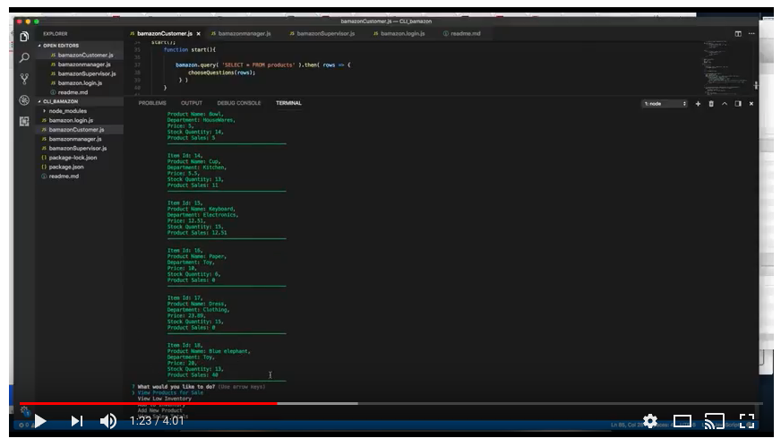

## Overview

This application is simulating an Amazon-like storefront via the command line. The app will take in orders from customers and deplete stock from the store's inventory. It tracks product sales across the store's departments and provides a summary of the highest-grossing departments in the store.

##Customer View
* Allows cutomer to purchase products from the store.

##Manager View
* View Products for Sale
    
* View Low Inventory
    
* Add to Inventory
    
* Add New Product

#Supervisor View
* View Product Sales by Department
   
* Create New Department

#Demo

